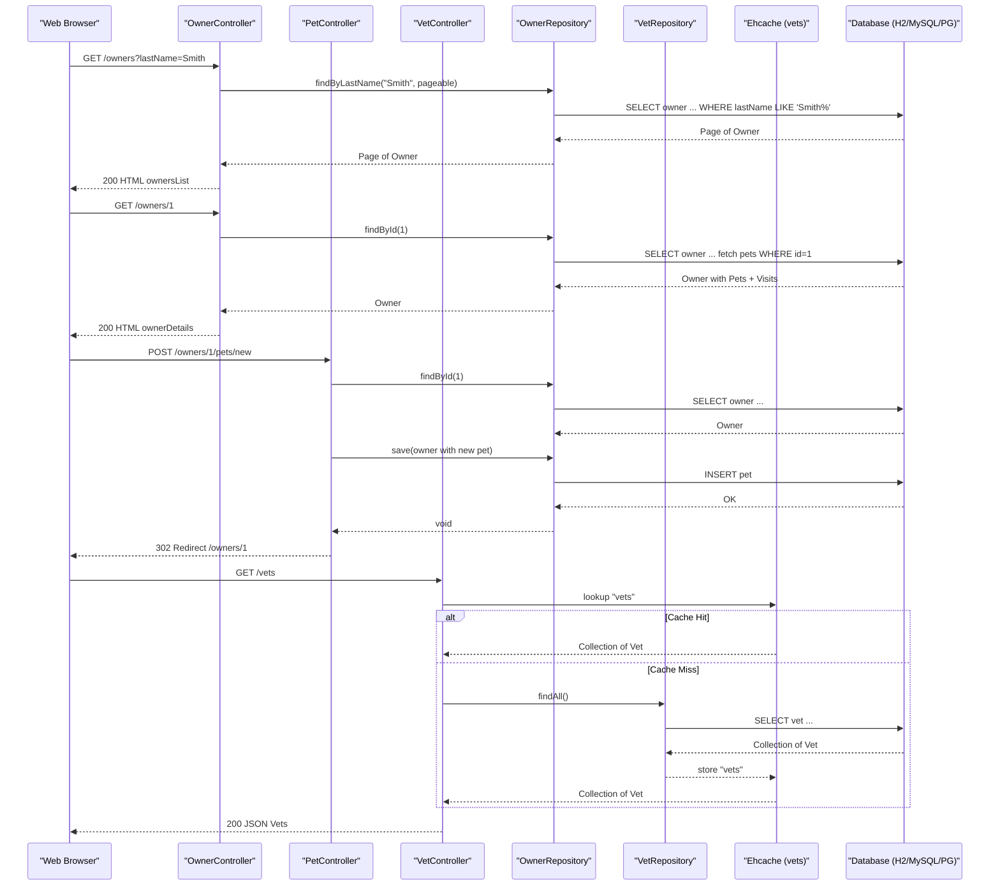

# API & Service Communication Contracts

Spring PetClinic exposes 16 HTTP endpoints across 5 Spring MVC controllers — all server-rendered HTML except for one JSON/XML REST endpoint on the Vet resource — with no inter-service communication, message broker, API gateway, or authentication layer.

## Service Catalog

| Service | Port | Category | Purpose |
|---------|------|----------|---------|
| spring-petclinic | 8080 (default) | Business | Single deployable Spring Boot application managing owners, pets, visits, and vets |

## API Endpoints Inventory

| Controller | Method | Path | Request Type | Response Type |
|-----------|--------|------|-------------|--------------|
| WelcomeController | GET | `/` | — | HTML (welcome view) |
| OwnerController | GET | `/owners/new` | — | HTML (createOrUpdateOwnerForm) |
| OwnerController | POST | `/owners/new` | Owner (form body) | Redirect to `/owners/{id}` or form with errors |
| OwnerController | GET | `/owners/find` | — | HTML (findOwners) |
| OwnerController | GET | `/owners` | `?page=N`, `lastName` query param | HTML (ownersList, paginated) |
| OwnerController | GET | `/owners/{ownerId}` | Path: ownerId | HTML (ownerDetails) |
| OwnerController | GET | `/owners/{ownerId}/edit` | Path: ownerId | HTML (createOrUpdateOwnerForm) |
| OwnerController | POST | `/owners/{ownerId}/edit` | Owner (form body), Path: ownerId | Redirect to `/owners/{ownerId}` or form with errors |
| PetController | GET | `/owners/{ownerId}/pets/new` | Path: ownerId | HTML (createOrUpdatePetForm) |
| PetController | POST | `/owners/{ownerId}/pets/new` | Pet (form body), Path: ownerId | Redirect to `/owners/{ownerId}` or form with errors |
| PetController | GET | `/owners/{ownerId}/pets/{petId}/edit` | Path: ownerId, petId | HTML (createOrUpdatePetForm) |
| PetController | POST | `/owners/{ownerId}/pets/{petId}/edit` | Pet (form body), Path: ownerId, petId | Redirect to `/owners/{ownerId}` or form with errors |
| VisitController | GET | `/owners/{ownerId}/pets/{petId}/visits/new` | Path: ownerId, petId | HTML (createOrUpdateVisitForm) |
| VisitController | POST | `/owners/{ownerId}/pets/{petId}/visits/new` | Visit (form body), Path: ownerId, petId | Redirect to `/owners/{ownerId}` or form with errors |
| VetController | GET | `/vets.html` | `?page=N` query param | HTML (vetList, paginated) |
| VetController | GET | `/vets` | — | JSON or XML (`Vets` wrapper) |
| CrashController | GET | `/oups` | — | HTTP 500 error page (intentional exception) |

## Management & Observability Endpoints

| Service | Endpoint | Notes |
|---------|----------|-------|
| spring-petclinic | `/actuator` | Discovery index for all enabled actuator endpoints |
| spring-petclinic | `/actuator/health` | Application health status |
| spring-petclinic | `/actuator/info` | Build info (from `build-info.properties` and `git.properties`) |
| spring-petclinic | `/actuator/metrics` | Micrometer metrics (all metrics exposed) |
| spring-petclinic | `/actuator/env` | Full environment properties |
| spring-petclinic | `/actuator/beans` | Spring bean definitions |
| spring-petclinic | `/actuator/heapdump` | JVM heap dump download |
| spring-petclinic | `/actuator/threaddump` | JVM thread dump |
| spring-petclinic | `/actuator/loggers` | Logger levels (read/write) |

All Actuator endpoints are enabled via `management.endpoints.web.exposure.include=*`. No custom `@Timed` or Micrometer metric registrations are present in application code; metrics are provided by Spring Boot auto-configuration (JVM, Tomcat, HTTP request metrics).

## DTOs & Contracts

The application uses JPA domain entities directly as MVC model objects — there are no separate DTO classes or request/response wrappers for the HTML endpoints. The single REST endpoint (`GET /vets`) returns a `Vets` wrapper object (containing a list of `Vet` entities) serialized by Jackson to JSON or JAXB to XML based on the `Accept` header.

| Class | Role | Immutable | Notes |
|-------|------|-----------|-------|
| `Owner` | Form request body + MVC model | No | Used as `@ModelAttribute` in create/update forms |
| `Pet` | Form request body + MVC model | No | Used as `@ModelAttribute`; validated by `PetValidator` |
| `Visit` | Form request body + MVC model | No | Used as `@ModelAttribute` in visit form |
| `Vet` | REST response element | No | Serialized inside `Vets` wrapper |
| `Vets` | REST response wrapper (`GET /vets`) | No | JAXB-annotated list wrapper; also JSON-serializable |
| `PetType` | Query parameter (formatter) | No | Converted from String by `PetTypeFormatter` |

No OpenAPI/Swagger specification, protobuf schemas, or GraphQL schemas are present. Jackson handles JSON serialization (via Spring Boot auto-configuration); JAXB handles XML serialization for the `Vets` class.

## Communication Patterns

**Synchronous only**: All communication is synchronous HTTP. There are no asynchronous messaging patterns, message brokers (Kafka, RabbitMQ), event-driven patterns, or reactive streams in the application.

**Single-service**: The application is a monolith with no inter-service REST calls, Feign clients, WebClient, or RestTemplate usage. All data access is through JPA repositories within the same JVM process.

**No resilience patterns**: No circuit breaker (Resilience4j, Spring Retry), retry policies, bulkhead patterns, or timeout configuration are present. The application relies on the default Tomcat thread pool and JPA connection pool timeouts.

**No service discovery**: The application registers with no service discovery system (no Eureka, Consul, or Kubernetes-based service registration). It is reached directly by hostname/port.

**No API gateway**: There is no gateway, BFF (backend-for-frontend), or API aggregation layer. The single deployed instance serves both UI and the `/vets` REST endpoint.

**Security posture**: No authentication or TLS is configured. All endpoints — including Actuator endpoints that expose environment variables, heap dumps, and bean definitions — are publicly accessible with no authorization checks. There is no Spring Security dependency, no JWT/OAuth2 integration, and no HTTPS configuration.

## Service Technology Matrix

| Service | Web Framework | Data Access | Discovery | Gateway | Actuator | Cache | Metrics |
|---------|-------------|-------------|-----------|---------|----------|-------|---------|
| spring-petclinic | Spring MVC (Servlet/Tomcat) | Spring Data JPA (Hibernate) | None | None | All endpoints exposed | Ehcache 3 (JCache) | Micrometer (auto) |

## Service Communication Sequence

