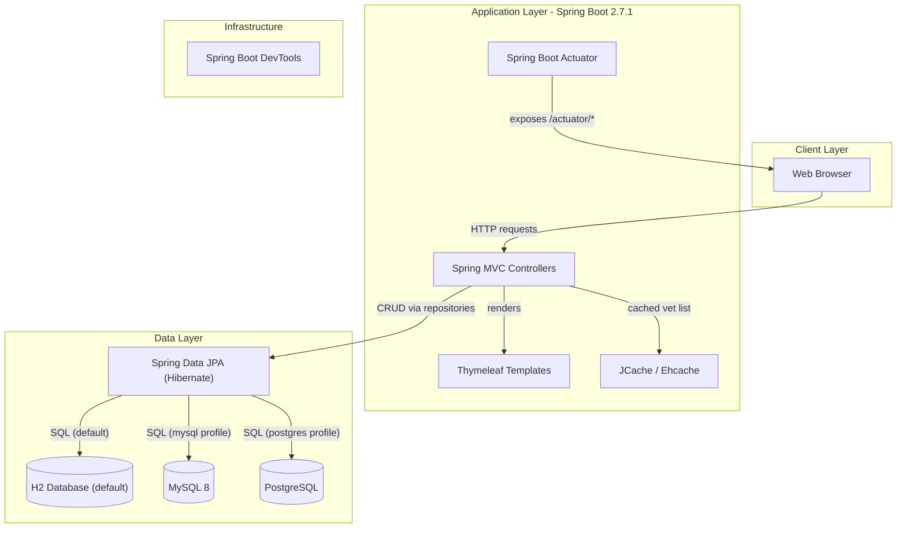
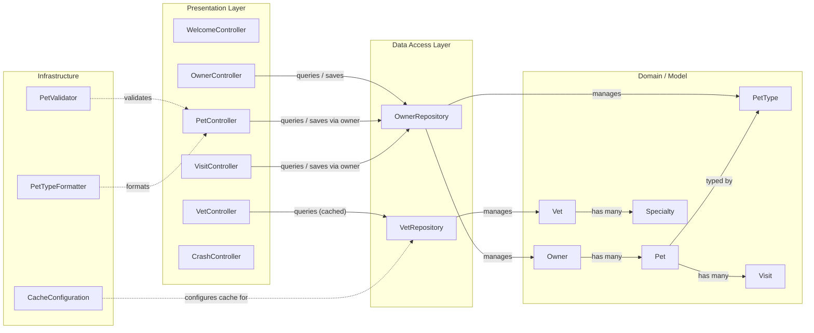

# Architecture Diagram

Spring PetClinic is a single-module Spring Boot 2.7.1 web application built on Java 8, demonstrating a classic layered MVC architecture with Thymeleaf views, Spring Data JPA repositories, and pluggable relational database backends (H2, MySQL, PostgreSQL).

## Application Architecture

### Technology Stack Summary

| Layer | Technology | Version | Purpose |
|-------|-----------|---------|---------|
| Presentation | Spring MVC | 5.3.x (via Boot 2.7.1) | HTTP request handling and routing |
| Presentation | Thymeleaf | 3.0.x | Server-side HTML template rendering |
| Presentation | Bootstrap | 5.1.3 | Responsive UI styling (WebJar) |
| Presentation | Font Awesome | 4.7.0 | UI icons (WebJar) |
| Business Logic | Spring Boot | 2.7.1 | Application framework and auto-configuration |
| Data Access | Spring Data JPA | 2.7.x | Repository abstraction over JPA/Hibernate |
| Data Storage | H2 | 2.x | In-memory database (default profile) |
| Data Storage | MySQL | 8.x | Relational database (mysql profile) |
| Data Storage | PostgreSQL | 14.x | Relational database (postgres profile) |
| Caching | Ehcache + JCache API | 3.x | Vet list caching |
| Monitoring | Spring Boot Actuator | 2.7.1 | Health checks and metrics endpoints |
| Build | Maven | 3.x | Build, dependency management, and packaging |

### Data Storage & External Services

The application uses a relational database for all persistent data. By default, H2 runs in embedded mode using DDL/DML scripts in `src/main/resources/db/h2/`. Profiles `mysql` and `postgres` switch to external MySQL 8 or PostgreSQL databases respectively, loading their own schema and data scripts. Vet data is cached in-process using Ehcache 3 through the standard JCache (JSR-107) API to avoid repeated database reads for a relatively static dataset. No external third-party services (email, messaging, object storage) are used.

### Key Architectural Decisions

- **Repository pattern via Spring Data JPA**: `OwnerRepository` and `VetRepository` extend `Repository<T, ID>` directly, keeping the data access API minimal and JPQL-driven rather than using the broader `JpaRepository` interface.
- **Profile-driven database selection**: The active Spring profile (`mysql`, `postgres`, or default H2) controls which `application-{profile}.properties` and SQL scripts are loaded, enabling zero-code database switching.
- **JCache-backed caching**: Vet list results are cached using `@Cacheable("vets")` with a JCache `MutableConfiguration`, providing pluggable cache provider support through the Ehcache 3 implementation.

## Component Relationships

### Component Inventory

| Component | Layer | Type | Responsibility |
|-----------|-------|------|---------------|
| WelcomeController | Presentation | Spring MVC Controller | Renders the application home/welcome page |
| OwnerController | Presentation | Spring MVC Controller | Owner CRUD: create, find, update, display (paginated) |
| PetController | Presentation | Spring MVC Controller | Pet CRUD: create and update pets on an owner |
| VisitController | Presentation | Spring MVC Controller | Visit CRUD: create and list visits for a pet |
| VetController | Presentation | Spring MVC Controller | Vet listing (HTML and JSON/XML endpoints, paginated) |
| CrashController | Presentation | Spring MVC Controller | Deliberate error endpoint for testing error handling |
| OwnerRepository | Data Access | Spring Data Repository | Owner + PetType JPA queries and persistence |
| VetRepository | Data Access | Spring Data Repository | Vet JPA queries with caching support |
| Owner | Domain | JPA Entity | Pet owner with address and contact information |
| Pet | Domain | JPA Entity | Pet belonging to an owner, with visits |
| PetType | Domain | JPA Entity | Pet type lookup (dog, cat, etc.) |
| Visit | Domain | JPA Entity | Veterinary visit record for a pet |
| Vet | Domain | JPA Entity | Veterinarian with specialties |
| Specialty | Domain | JPA Entity | Vet specialty (surgery, dentistry, etc.) |
| CacheConfiguration | Infrastructure | Spring Configuration | Registers and configures JCache "vets" cache via Ehcache |
| PetValidator | Infrastructure | Spring Validator | Validates pet name and type on form submission |
| PetTypeFormatter | Infrastructure | Spring Formatter | Converts PetType name strings to/from PetType entities |
