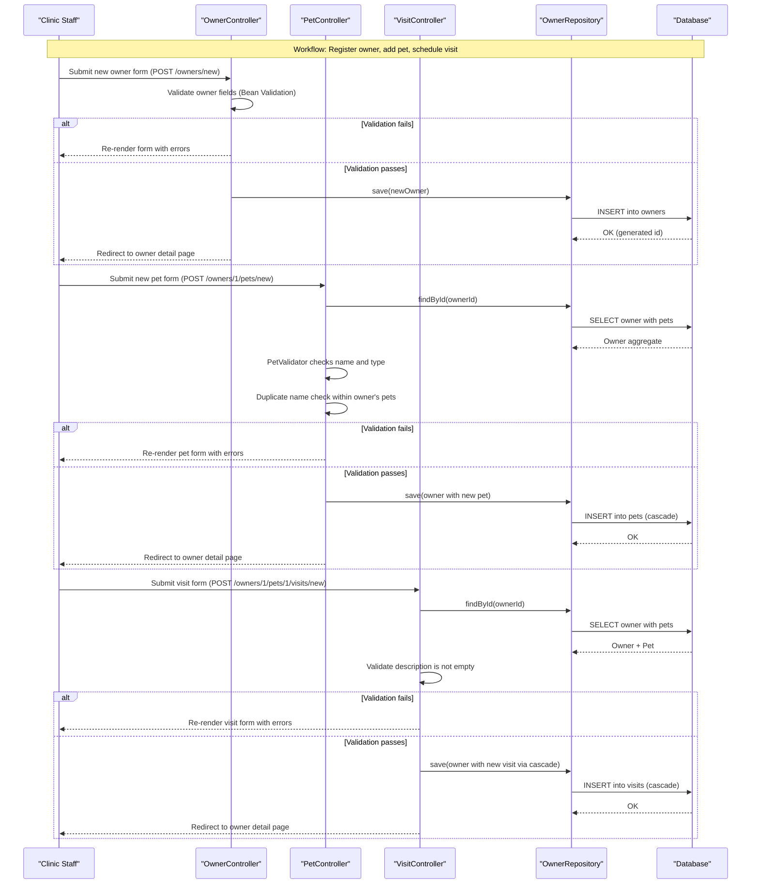

# Core Business Workflows

Spring PetClinic is a veterinary practice management application that allows clinic staff to register pet owners, manage their pets, schedule veterinary visits, and browse the clinic's roster of veterinarians with their specialties.

## Domain Entities

| Entity | Service / Bounded Context | Description | Key Relationships |
|--------|--------------------------|-------------|------------------|
| Owner | Owner Management | A person who brings pets to the clinic; the primary aggregate root for the owner-pet-visit hierarchy | Has many Pets (cascade all); root of the owner aggregate |
| Pet | Owner Management | An animal owned by an Owner; tracks name, birth date, and species type | Belongs to one Owner; has one PetType; has many Visits (cascade all) |
| PetType | Owner Management | A lookup / reference entity defining the species of a pet (dog, cat, hamster, etc.) | Used by Pet as a type reference |
| Visit | Owner Management | A single clinic appointment record attached to a Pet, capturing the date and clinical description | Belongs to one Pet; created/deleted via Pet cascade |
| Vet | Vet Management | A veterinarian employed by the clinic, identified by name and a set of medical specialties | Has many Specialties (many-to-many) |
| Specialty | Vet Management | A medical specialty area (e.g., surgery, dentistry, radiology) that a Vet may possess | Associated with many Vets |

## Service-to-Domain Mapping

This is a single-service monolith, so all domain contexts live within the same deployable unit. Logically the codebase separates two bounded contexts by Java package:

| Service / Module | Domain Context | Owned Entities | External Dependencies |
|-----------------|---------------|---------------|----------------------|
| `owner` package | Owner Management | Owner, Pet, PetType, Visit | None; uses `OwnerRepository` for all persistence |
| `vet` package | Vet Management | Vet, Specialty | None; uses `VetRepository` for all persistence; vet list served from cache |

The two contexts share the same database schema but do not call each other. The `owner` context is the source of truth for all pet and visit data; the `vet` context owns all vet and specialty data.

## Primary Workflows

### Workflow 1: Register a New Owner

A staff member registers a new pet owner so their pets can be tracked in the system.

1. Staff navigates to the owner registration form (`GET /owners/new`).
2. Staff fills in first name, last name, address, city, and telephone, then submits (`POST /owners/new`).
3. Spring MVC binds the form fields to an `Owner` object and invokes Bean Validation.
4. If validation fails (empty required fields, telephone longer than 10 digits), the form is re-rendered with error messages.
5. If validation passes, `OwnerRepository.save(owner)` persists the new Owner to the database.
6. The user is redirected to the owner's detail page.

### Workflow 2: Find and Update an Existing Owner

1. Staff searches by last name (`GET /owners?lastName=Smith`); the repository performs a paginated `LIKE 'Smith%'` query.
2. If exactly one match is found, the user is redirected directly to that owner's detail page.
3. If multiple matches are found, a paginated list is displayed; staff selects one to view.
4. Staff clicks Edit, which loads the update form (`GET /owners/{ownerId}/edit`).
5. Staff modifies fields and submits (`POST /owners/{ownerId}/edit`).
6. Validation runs again; on success the owner is saved and the user is redirected to the detail page.

### Workflow 3: Add a Pet to an Owner

1. From the owner detail page, staff clicks "Add New Pet" (`GET /owners/{ownerId}/pets/new`).
2. The form is pre-populated with the available PetType lookup values from the database.
3. Staff enters pet name, birth date, and selects a type, then submits (`POST /owners/{ownerId}/pets/new`).
4. `PetValidator` checks that name is not blank and a type is selected.
5. A duplicate name check verifies that the same owner does not already have a pet with the identical name.
6. If validation passes, the pet is added to the owner aggregate and `OwnerRepository.save(owner)` cascades the insert to the `pets` table.
7. Staff is redirected to the owner's detail page showing the new pet.

### Workflow 4: Schedule a Veterinary Visit

1. From the owner detail page, staff clicks "Add Visit" for a specific pet (`GET /owners/{ownerId}/pets/{petId}/visits/new`).
2. Before the form renders, `VisitController.loadPetWithVisit()` loads the owner and pet from the database and pre-initialises a new `Visit` with today's date.
3. Staff optionally changes the visit date and enters a description of the clinical reason, then submits (`POST /owners/{ownerId}/pets/{petId}/visits/new`).
4. Bean Validation checks that the description is not empty.
5. If validation passes, `Owner.addVisit(petId, visit)` attaches the visit to the correct pet in the aggregate, and `OwnerRepository.save(owner)` cascades the insert to the `visits` table.
6. Staff is redirected to the owner's detail page, which now lists the new visit under the relevant pet.

### Workflow 5: Browse the Veterinarian Roster

1. Staff navigates to the vet list page (`GET /vets.html?page=N`).
2. `VetController.showVetList()` requests a paginated list from `VetRepository.findAll(pageable)`.
3. The repository method is annotated `@Cacheable("vets")`. On the first request the database is queried; on subsequent requests the result is served from the in-process cache, reducing database load.
4. The HTML page renders each vet with their name and comma-separated specialties.
5. Alternatively, `GET /vets` returns the full vet list as a JSON (or XML) response for API consumers.

## Cross-Service Data Flows

Spring PetClinic is a single-service application with no inter-service communication. All data flows are intra-service JPA calls within the same JVM process. There is no API gateway aggregation, no event-driven communication, and no circuit breaker.

The one notable data composition pattern occurs on the **owner detail page**: the `Owner` entity is loaded with `left join fetch owner.pets` so pets are eagerly populated, and each `Pet` in turn eagerly loads its `Visit` collection. This produces a fully denormalised owner-pets-visits graph in a single traversal of the object graph, making the detail view self-contained without additional queries.

Since the application is a monolith, service-unavailability fallback patterns are not applicable. The only degradation path is a database connectivity failure, which surfaces as an unhandled exception and an error page.

## Business Workflow Sequence

## Business Rules & Decision Logic

### Validation Rules

| Entity | Rule | Enforced By |
|--------|------|------------|
| Owner | `firstName`, `lastName`, `address`, `city`, `telephone` must not be empty | `@NotEmpty` on `Person` / `Owner` fields (Bean Validation) |
| Owner | `telephone` must be numeric and at most 10 digits | `@Digits(fraction=0, integer=10)` on `Owner.telephone` |
| Pet | `name` must not be blank | `PetValidator.validate()` — rejects blank name |
| Pet | `type` must be selected | `PetValidator.validate()` — rejects null PetType |
| Pet | `name` must be unique within the same owner (new pets only) | `PetController.processCreationForm()` — calls `owner.getPet(name, true)` and rejects if result is non-null |
| Visit | `description` must not be empty | `@NotEmpty` on `Visit.description` (Bean Validation) |

### Decision Logic

- **Owner search result branching**: If the last-name search returns exactly 1 result the user is redirected directly to that owner's detail page; if it returns 0 results an error is shown on the search form; if it returns more than 1 the paginated list is displayed.
- **Duplicate pet name guard**: Only applies to *new* (not yet persisted) pets. The `ignoreNew=true` flag in `owner.getPet(name, true)` excludes the current unsaved pet from the duplicate check, preventing a false-positive against itself.
- **Visit date default**: A new `Visit` object pre-sets `visitDate = LocalDate.now()` in its no-argument constructor, providing a sensible default that staff can override.

### Data Integrity Rules

- **Owner aggregate root**: Pets and Visits are always created and saved through the `Owner` aggregate root via `OwnerRepository.save(owner)`. Direct saves to `Pet` or `Visit` outside the owner are not supported by the repository API, enforcing aggregate boundaries.
- **Bidirectional relationship maintenance**: `Owner.addPet(pet)` adds the pet to the owner's list only when the pet is new (not yet persisted), preventing duplicates in the in-memory collection. `Pet.addVisit(visit)` appends visits to the pet's set directly.
- **Cascade semantics**: `CascadeType.ALL` on `Owner.pets` and `Pet.visits` means that deleting an owner would cascade to pets and then to visits. No delete workflow currently exists in the UI, but the schema cascade is active at the ORM level.

### Transaction Boundaries

- All repository read methods are annotated `@Transactional(readOnly = true)`.
- `OwnerRepository.save()` is inherited from Spring Data and runs in a default read-write transaction.
- No explicit `@Transactional` annotations appear on controllers or service classes; transaction boundaries are managed at the repository method level.
- No saga patterns, eventual consistency, or compensating transactions are present.

### Error Handling

- Bean Validation errors are captured by Spring MVC's `BindingResult` and surfaced as form field errors on the same HTML view.
- The `CrashController` (`GET /oups`) intentionally throws a `RuntimeException` to demonstrate Spring Boot's whitelabel error page; it has no business purpose.
- No custom business exception hierarchy, dead-letter queues, or compensating actions are defined.

### Authorization

No authentication or role-based authorization is implemented. All workflows are publicly accessible. There are no `@PreAuthorize`, `@Secured`, or `@RolesAllowed` annotations anywhere in the codebase.
