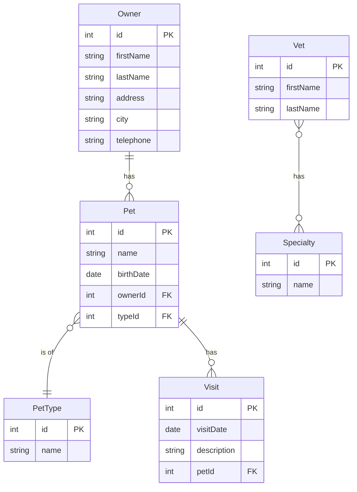

# Data Architecture & Persistence Layer

Spring PetClinic uses a single relational schema with 7 tables managed by 6 JPA entities (plus 3 mapped superclasses), accessed via Hibernate ORM through two Spring Data Repository interfaces and supporting pluggable H2, MySQL, or PostgreSQL backends.

## Database Configuration

| Module | DB Type | Profile | Driver | Connection | Migration Tool |
|--------|---------|---------|--------|------------|---------------|
| spring-petclinic | H2 (in-memory) | default (no profile) | `com.h2database:h2` | Embedded, in-memory; URL not configured externally | SQL init scripts (`schema.sql` + `data.sql`); Hibernate does not manage schema (`ddl-auto=none`) |
| spring-petclinic | MySQL 8 | `mysql` | `mysql:mysql-connector-java` | JDBC URL from env var `MYSQL_URL` (default: `jdbc:mysql://localhost/petclinic`); credentials from `MYSQL_USER`/`MYSQL_PASS` | SQL init scripts (`schema.sql` + `data.sql`); `spring.sql.init.mode=always` (idempotent scripts) |
| spring-petclinic | PostgreSQL | `postgres` | `org.postgresql:postgresql` | JDBC URL from env var `POSTGRES_URL` (default: `jdbc:postgresql://localhost/petclinic`); credentials from `POSTGRES_USER`/`POSTGRES_PASS` | SQL init scripts (`schema.sql` + `data.sql`); `spring.sql.init.mode=always` (idempotent scripts) |

No Flyway, Liquibase, or other versioned migration tool is used. Schema management is handled entirely by per-database SQL scripts under `src/main/resources/db/{h2,mysql,postgres}/`. HikariCP is the default connection pool (Spring Boot auto-configuration); no custom pool sizing is configured. For the full property inventory see `configuration-inventory.md`.

## Data Ownership per Service

| Service | Tables Owned | ORM Framework | Caching | Notes |
|---------|-------------|--------------|---------|-------|
| spring-petclinic | owners, pets, types, visits, vets, specialties, vet_specialties | Hibernate 5.6.x via Spring Data JPA | Ehcache 3 (JCache) for `vets` table reads | Single deployable; all tables owned in one schema; no schema-per-service separation |

## Entity Model

**Inheritance hierarchy (mapped superclasses — not separate tables):**
- `BaseEntity` → provides `id` (auto-generated `INTEGER` PK, `IDENTITY` strategy) and `isNew()` check
- `NamedEntity extends BaseEntity` → adds `name` column; used by `PetType` and `Specialty`
- `Person extends BaseEntity` → adds `firstName` + `lastName`; used by `Owner` and `Vet`

**Fetch strategy and cascade:**
- `Owner.pets`: `@OneToMany(cascade = ALL, fetch = EAGER)` — all pets are loaded with the owner; saving the owner cascades to pets
- `Pet.visits`: `@OneToMany(cascade = ALL, fetch = EAGER)` — all visits are loaded with the pet; cascade ALL propagates saves/deletes
- `Pet.type`: `@ManyToOne` — default `EAGER` for `@ManyToOne`; no cascade
- `Vet.specialties`: `@ManyToMany(fetch = EAGER)` via `vet_specialties` join table; no cascade

All `@Transactional(readOnly = true)` annotations are applied at the repository interface method level. Write operations rely on the default transaction from Spring Data repository's `save()`.

## Key Repository Methods

| Repository | Entity | Notable Custom Methods | Purpose |
|-----------|--------|----------------------|---------|
| `OwnerRepository` | `Owner` | `findByLastName(String lastName, Pageable pageable)` | Paginated search by last name prefix using JPQL `LIKE :lastName%` |
| `OwnerRepository` | `Owner` | `findById(Integer id)` | Fetch owner with pets eagerly loaded (JPQL `left join fetch owner.pets`) |
| `OwnerRepository` | `Owner` | `findAll(Pageable pageable)` | Paginated full owner list |
| `OwnerRepository` | `PetType` | `findPetTypes()` | Returns all `PetType` records ordered by name (used to populate pet creation form) |
| `OwnerRepository` | `Owner` | `save(Owner owner)` | Persists owner and cascades to pets and visits |
| `VetRepository` | `Vet` | `findAll()` | Returns all vets as `Collection<Vet>` (cached under `"vets"`) |
| `VetRepository` | `Vet` | `findAll(Pageable pageable)` | Paginated vet list (cached under `"vets"`) |

Both repositories extend `Repository<T, ID>` (the minimal Spring Data marker interface) rather than `JpaRepository`, keeping the public API intentionally small. No `@NamedQuery`, stored procedures, or `@NativeQuery` are used.

## Caching Strategy

| Cache Name | Provider | Scope | Pattern | Rationale |
|-----------|---------|-------|---------|-----------|
| `vets` | Ehcache 3 via JCache (JSR-107) | In-process JVM | Cache-aside (`@Cacheable`) | Vet data changes rarely; caching avoids repeated `SELECT vet ... ` + `vet_specialties` JOIN on every page load |

**Configuration**: `CacheConfiguration` (in `system` package) registers the `"vets"` cache via a `JCacheManagerCustomizer` bean using a `MutableConfiguration` with statistics enabled. No TTL or size limit is explicitly set — the cache lives for the JVM lifetime. No `@CacheEvict` annotation exists, meaning the cache is never invalidated at runtime; a restart is required to pick up vet data changes.

**Second-level cache**: Hibernate's second-level cache is not enabled. All caching is done at the repository method level via Spring's `@Cacheable` abstraction.

## Data Ownership Boundaries

The application uses a **shared single-database, single-schema** topology: all 7 tables reside in the same schema, owned and accessed exclusively by the single `spring-petclinic` service. There are no separate databases per bounded context and no cross-service data access patterns (no Feign clients, no remote repository calls). All data access is through direct JPA within the same JVM.

**Read/write patterns**: The owner, pet, and visit aggregate is write-heavy (form submissions). The vet listing is read-heavy and benefits from the in-process cache. No CQRS pattern is applied — the same repositories serve both reads and writes.

### Data Classification & Sensitivity

| Entity | Sensitive Fields | Classification | Controls in Place |
|--------|----------------|---------------|------------------|
| `Owner` | `firstName`, `lastName`, `address`, `city`, `telephone` | PII | None — stored in plaintext; no encryption-at-rest, data masking, or field-level access control configured |
| `Vet` | `firstName`, `lastName` | PII (minimal — professional directory data) | None — stored in plaintext |
| `Visit` | `description` (may contain medical notes) | Potentially PHI | None — stored in plaintext; no access control or encryption |
| `Pet` | `name`, `birthDate` | Non-sensitive | N/A |
| `PetType` | `name` | Non-sensitive | N/A |
| `Specialty` | `name` | Non-sensitive | N/A |

The `Owner` entity stores PII (name, address, telephone) and the `Visit.description` field may contain health-related notes classifiable as PHI. No encryption-at-rest, field-level masking, RBAC, or audit logging is configured. The database credentials are injected via environment variables (not hardcoded in source), which is the only data-security control present.
