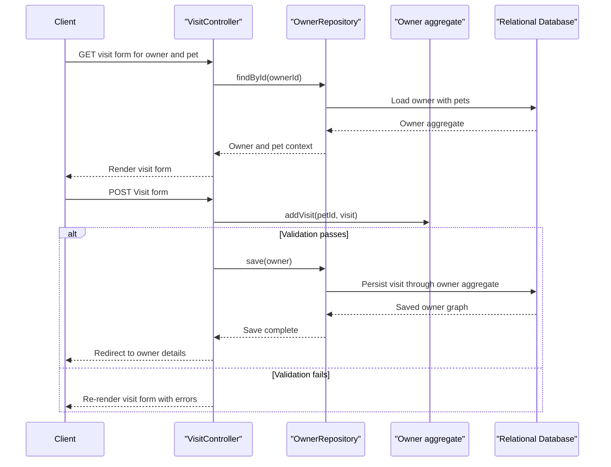

# API & Service Communication Contracts

The application exposes a small HTTP surface focused on server-rendered owner, pet, visit, and veterinarian workflows, plus one JSON veterinarian listing endpoint. All communication is synchronous inside a single Spring Boot process with no remote downstream services.

## Service Catalog

| Service | Port | Category | Purpose |
| --- | --- | --- | --- |
| spring-petclinic | 8080 by default, 8000 debug in Docker development | Business | Serves owner, pet, visit, and veterinarian workflows through Spring MVC and Thymeleaf |

## API Endpoints Inventory

| Service | Method | Path | Request Type | Response Type |
| --- | --- | --- | --- | --- |
| spring-petclinic | GET | / | none | HTML welcome view |
| spring-petclinic | GET | /oups | none | Throws runtime exception, rendered error response |
| spring-petclinic | GET | /owners/find | none | HTML owner search form |
| spring-petclinic | GET | /owners | query `page`, owner last name form fields | HTML owner list or redirect to owner details |
| spring-petclinic | GET | /owners/new | none | HTML owner creation form |
| spring-petclinic | POST | /owners/new | form body bound to `Owner` | Redirect to `/owners/{ownerId}` on success or HTML form with validation errors |
| spring-petclinic | GET | /owners/{ownerId} | path `ownerId` | HTML owner details view |
| spring-petclinic | GET | /owners/{ownerId}/edit | path `ownerId` | HTML owner edit form |
| spring-petclinic | POST | /owners/{ownerId}/edit | form body bound to `Owner` | Redirect to owner details or HTML form with validation errors |
| spring-petclinic | GET | /owners/{ownerId}/pets/new | path `ownerId` | HTML pet creation form |
| spring-petclinic | POST | /owners/{ownerId}/pets/new | form body bound to `Pet` | Redirect to owner details or HTML form with duplicate-name and validation errors |
| spring-petclinic | GET | /owners/{ownerId}/pets/{petId}/edit | path `ownerId`, `petId` | HTML pet edit form |
| spring-petclinic | POST | /owners/{ownerId}/pets/{petId}/edit | form body bound to `Pet` | Redirect to owner details or HTML form with validation errors |
| spring-petclinic | GET | /owners/{ownerId}/pets/{petId}/visits/new | path `ownerId`, `petId` | HTML visit creation form |
| spring-petclinic | POST | /owners/{ownerId}/pets/{petId}/visits/new | form body bound to `Visit` | Redirect to owner details or HTML form with validation errors |
| spring-petclinic | GET | /vets.html | query `page` | HTML veterinarian list |
| spring-petclinic | GET | /vets | none | `Vets` response body serialized as JSON or XML |

## Management & Observability Endpoints

| Service | Endpoint | Custom Metrics (if any) |
| --- | --- | --- |
| spring-petclinic | `/actuator/*` | No custom application metrics found; only Spring Boot Actuator built-ins are configured |

## DTOs & Contracts

The codebase does not define separate API DTO classes. MVC handlers bind directly to mutable domain entities such as `Owner`, `Pet`, and `Visit`, and the veterinarian API returns a mutable `Vets` wrapper around `Vet` entities for easier JSON and XML serialization. No immutable records, OpenAPI specification, protobuf schema, or GraphQL contract files are present. Serialization relies on Spring Boot HTTP message converters with Jackson by default, while `Vets` and `Vet` also carry JAXB annotations to support XML marshalling.

## Communication Patterns

All request handling is synchronous. Browser clients submit HTML form data or request server-rendered pages, controllers load aggregates through `OwnerRepository` or `VetRepository`, and persistence is executed through Spring Data JPA against a relational database. No asynchronous messaging, retry policies, circuit breakers, bulkheads, service discovery, API gateway, or client-side load balancing are configured. Startup dependency only matters for the optional Docker Compose environment, where the application container depends on MySQL; otherwise the app can start standalone against the embedded default database. At the API contract level there is no configured authentication, authorization, or TLS enforcement in the repository, so endpoints are publicly reachable in a plain sample deployment.

## Service Technology Matrix

| Service | Web | Data Access | Discovery | Gateway | Actuator | Cache | Metrics |
| --- | --- | --- | --- | --- | --- | --- | --- |
| spring-petclinic | Spring MVC plus Thymeleaf | Spring Data repository interfaces with JPA | none | none | yes | `vets` cache | Actuator built-ins |

## Service Communication Sequence

