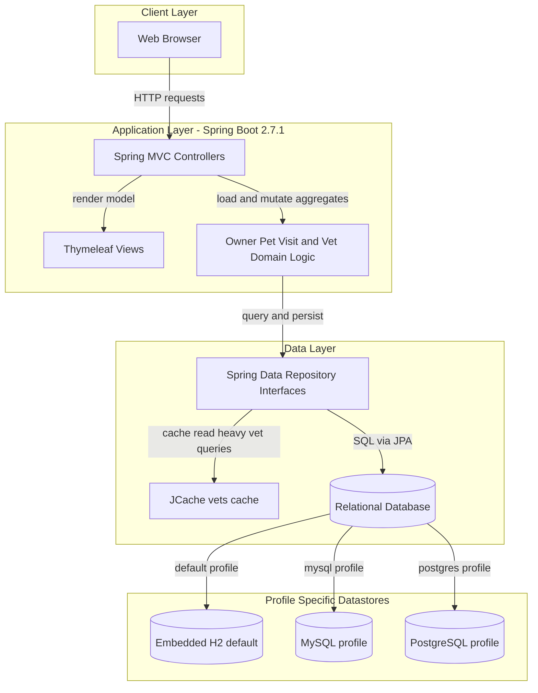
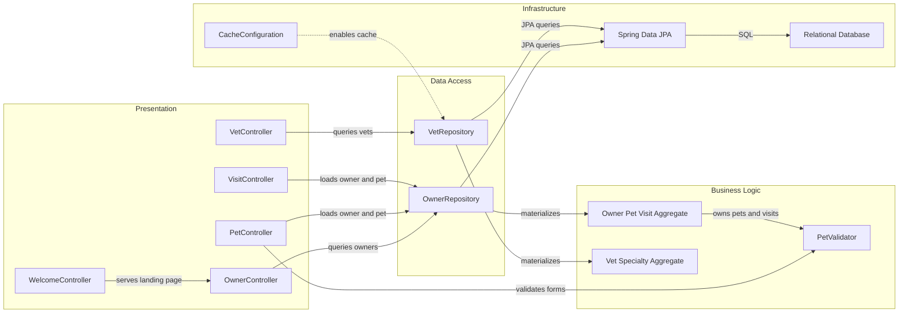

# Architecture Diagram

This Spring PetClinic repository is a single deployable Spring Boot web application. Its runtime architecture centers on Spring MVC request handling, a JPA-backed persistence layer, and a small cache for veterinarian lookups.

## Application Architecture

### Technology Stack Summary

| Layer | Technology | Version | Purpose |
| --- | --- | --- | --- |
| Presentation | Spring MVC + Thymeleaf | Spring Boot 2.7.1 managed | Server-side HTML forms and page rendering |
| Application | Spring Boot | 2.7.1 | Bootstraps the monolithic application and autoconfiguration |
| Domain | Java domain entities and validators | Java 8 target | Encodes owner, pet, visit, and vet business rules |
| Data Access | Spring Data repository interfaces + Hibernate/JPA | Spring Boot managed | Reads and writes relational data |
| Caching | Spring Cache + JCache + Ehcache | cache-api managed, Ehcache managed | Caches veterinarian queries |
| Operations | Spring Boot Actuator | Spring Boot 2.7.1 managed | Exposes management and metrics endpoints |

### Data Storage & External Services

The application persists all operational data in a single relational database schema. It defaults to an embedded H2 database during local execution, while `mysql` and `postgres` profiles switch the same schema and seed scripts to MySQL or PostgreSQL. No outbound API, message broker, or third-party SaaS integration is implemented in the source tree.

### Key Architectural Decisions

- Uses a classic server-rendered monolith: controllers, views, repositories, and entities are packaged together in one Spring Boot deployment unit.
- Reuses one domain model across HTML form binding, JSON responses, and persistence instead of introducing a separate service or DTO layer.
- Applies caching only to veterinarian lookups, which are read frequently and change rarely.

## Component Relationships

### Component Inventory

| Component | Layer | Type | Responsibility |
| --- | --- | --- | --- |
| WelcomeController | Presentation | MVC Controller | Serves the landing page |
| OwnerController | Presentation | MVC Controller | Handles owner search, create, update, and detail flows |
| PetController | Presentation | MVC Controller | Creates and edits pets under an owner |
| VisitController | Presentation | MVC Controller | Records visits for an existing pet |
| VetController | Presentation | MVC Controller and JSON endpoint | Lists veterinarians in HTML and JSON |
| PetValidator | Business Logic | Validator | Enforces required pet name, type, and birth date rules |
| Owner aggregate | Business Logic | Domain aggregate | Owns owner, pet, and visit relationships plus duplicate-name checks |
| Vet aggregate | Business Logic | Domain aggregate | Represents veterinarians and specialties |
| OwnerRepository | Data Access | Spring Data repository | Searches owners, pet types, and owner detail graphs |
| VetRepository | Data Access | Spring Data repository | Loads veterinarian directories with caching |
| CacheConfiguration | Infrastructure | Spring configuration | Creates the `vets` cache region and enables statistics |
| Spring Data JPA | Infrastructure | Persistence framework | Maps entities to the relational schema |
