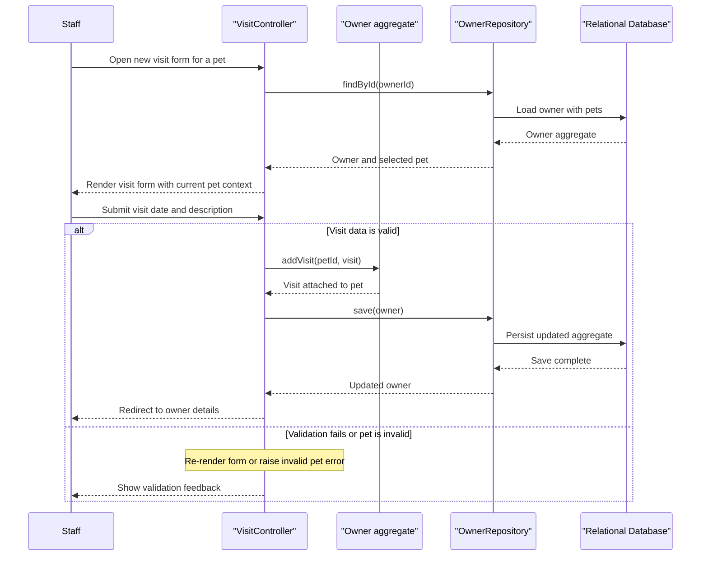

# Core Business Workflows

Spring PetClinic supports veterinary office staff who manage pet owners, their animals, recorded visits, and the veterinarian directory. The main workflows revolve around registering households, maintaining pet records, and recording care interactions for an existing pet.

## Domain Entities

| Entity | Service / Bounded Context | Description | Key Relationships |
| --- | --- | --- | --- |
| Owner | Owner Management | Represents the customer household responsible for one or more pets | Owns many pets and aggregates visit creation through those pets |
| Pet | Pet Management | Represents an individual animal belonging to an owner | Belongs to one owner, has one pet type, accumulates many visits |
| Visit | Visit Recording | Captures one veterinary encounter for a pet | Belongs to one pet and is created from the owner detail workflow |
| PetType | Reference Data | Defines the species or category used during pet registration | Reused by many pets |
| Vet | Staff Directory | Represents a veterinarian listed to users | Linked to many specialties |
| Specialty | Staff Expertise | Describes an area of veterinary expertise | Shared across many veterinarians |

## Service-to-Domain Mapping

| Service | Domain Context | Owned Entities | External Dependencies |
| --- | --- | --- | --- |
| spring-petclinic owner flows | Owner and Pet Management | Owner, Pet, Visit, PetType | Relational database through `OwnerRepository` |
| spring-petclinic vet flows | Veterinarian Directory | Vet, Specialty | Relational database and `vets` cache through `VetRepository` |
| spring-petclinic system flows | Navigation and error handling | none | Spring MVC runtime only |

## Primary Workflows

### Workflow 1: Search and review owner records

Staff opens `/owners/find`, submits an optional last-name prefix, and the application queries `OwnerRepository.findByLastName`. If no owners are found, the same form is re-rendered with a `not found` validation message. A single result redirects directly to the owner's detail page, while multiple matches are paginated and shown as a list.

### Workflow 2: Register or update a pet under an owner

From an owner context, staff opens the pet create or edit form. `PetController` loads the owner aggregate, populates pet type reference data, and applies `PetValidator` to ensure name, type, and birth date are present. During creation the controller also enforces the business rule that one owner cannot register two pets with the same name. On success the owner aggregate is saved, cascading pet changes to persistence.

### Workflow 3: Record a visit for an existing pet

Staff opens the new visit form for a selected pet. `VisitController` preloads the owner and pet, attaches a new `Visit` defaulted to the current date, and accepts a non-empty description. If validation passes, the visit is added through `Owner.addVisit`, which verifies that the targeted pet exists before the aggregate is persisted and the user is redirected back to the owner details screen.

### Workflow 4: Browse veterinarian availability and specialties

Users request `/vets.html` or `/vets`. `VetController` pages or returns the full veterinarian directory, and `VetRepository` serves the underlying data through a cacheable query path to reduce repeated reads for largely static reference data.

## Cross-Service Data Flows

No cross-service or cross-process data flow exists because the application is a single monolith with one database. The only composition step of note is the owner detail workflow, where one aggregate exposes owner data together with associated pets and their visits for rendering. Because there are no remote dependencies, there is no circuit-breaker fallback path; failures surface as normal in-process exceptions or validation errors.

## Business Workflow Sequence

## Business Rules & Decision Logic

- Owner search treats a blank last name as a request for all owners, then branches between zero results, one result redirect, or a paginated list.
- `PetValidator` requires pet name, pet type, and birth date before a pet can be created or updated.
- `PetController` rejects duplicate pet names within the same owner during pet creation.
- `Visit` defaults its date to the current day, and visit creation requires a non-empty description.
- `Owner.addVisit` and `Owner.getPet` protect aggregate integrity by ensuring the selected pet exists before attaching a visit.
- Repository methods are marked read-only where appropriate, and owner saves act as the transaction boundary for cascaded pet and visit persistence.
- No business-level authorization rules are implemented in the repository; all workflows are accessible without user roles.
