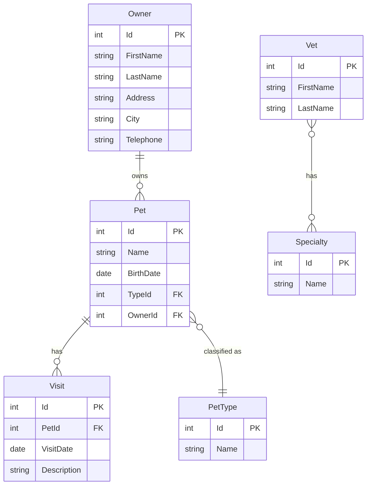

# Data Architecture & Persistence Layer

The application uses a compact relational domain model centered on owners, pets, visits, and veterinarians. Persistence is handled through Spring Data repository interfaces backed by JPA and Hibernate, with profile-driven database selection and a single read-mostly cache.

## Database Configuration

| Service/Module | DB Type | Profile | Driver | Connection | Migration Tool |
| --- | --- | --- | --- | --- | --- |
| spring-petclinic | Embedded H2 | default | H2 runtime dependency | Auto-configured in-memory datasource with schema and data scripts under `db/h2` | SQL init scripts (`schema.sql`, `data.sql`) |
| spring-petclinic | MySQL | mysql | `mysql-connector-java` | `${MYSQL_URL:jdbc:mysql://localhost/petclinic}` with `${MYSQL_USER}` and `${MYSQL_PASS}` | SQL init scripts under `db/mysql` |
| spring-petclinic | PostgreSQL | postgres | `postgresql` | `${POSTGRES_URL:jdbc:postgresql://localhost/petclinic}` with `${POSTGRES_USER}` and `${POSTGRES_PASS}` | SQL init scripts under `db/postgres` |

## Data Ownership per Service

| Service | Tables Owned | ORM Framework | Caching | Notes |
| --- | --- | --- | --- | --- |
| spring-petclinic | owners, pets, visits, types, vets, specialties, vet_specialties | Spring Data repository interfaces over JPA and Hibernate | JCache `vets` region backed by Ehcache | Single schema shared by the whole monolith |

## Entity Model

## Key Repository Methods

| Service | Repository | Notable Methods | Purpose |
| --- | --- | --- | --- |
| spring-petclinic | `OwnerRepository` | `findPetTypes()` | Returns pet type reference data for pet forms |
| spring-petclinic | `OwnerRepository` | `findByLastName(String, Pageable)` | Searches owners by last-name prefix with pagination |
| spring-petclinic | `OwnerRepository` | `findById(Integer)` | Loads one owner with eagerly fetched pets for detail and mutation workflows |
| spring-petclinic | `OwnerRepository` | `save(Owner)` | Persists owner aggregates together with cascaded pet and visit changes |
| spring-petclinic | `VetRepository` | `findAll()` | Returns the veterinarian directory and participates in caching |
| spring-petclinic | `VetRepository` | `findAll(Pageable)` | Paginates veterinarian listings for the HTML view |

## Caching Strategy

| Cache Region | Provider | TTL / Eviction | Pattern | Rationale |
| --- | --- | --- | --- | --- |
| `vets` | Spring Cache over JCache with Ehcache on the classpath | Not specified in code; only statistics are enabled programmatically | Cache-aside through `@Cacheable` repository methods | Veterinarian data is read often and changes rarely |

## Data Ownership Boundaries

All business data lives in one shared relational database owned by the single Spring Boot deployment. There are no isolated service schemas, no direct cross-service database calls, and no CQRS split; controllers call repositories directly and manipulate aggregates in-process before JPA flushes the changes. The owner detail flow effectively composes owner, pet, and visit data inside one aggregate rather than across multiple services.

### Data Classification & Sensitivity

| Entity | Sensitive Fields | Classification (PII/PHI/PCI/None) | Controls in Place |
| --- | --- | --- | --- |
| Owner | `firstName`, `lastName`, `address`, `city`, `telephone` | PII | No encryption at rest, masking, or field-level controls are configured in the repository |
| Vet | `firstName`, `lastName` | PII | No explicit data protection controls are configured |
| Pet | `name`, `birthDate` | None | No special controls configured |
| Visit | `description`, `visitDate` | None | No special controls configured |
| PetType | none | None | Not applicable |
| Specialty | none | None | Not applicable |
