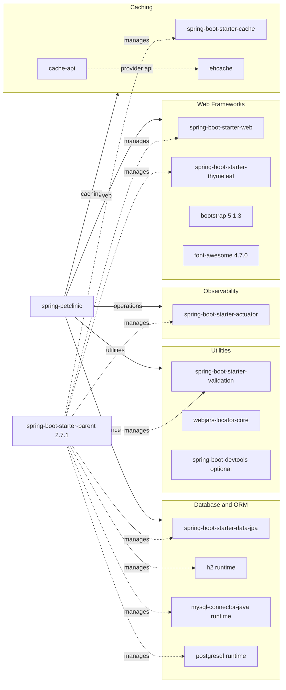

# Dependency Map

This project declares 14 non-test dependencies in a single Maven module, with most versions inherited from the Spring Boot parent BOM. The dependency set is compact and focused on a traditional Spring MVC application with relational persistence and a small cache layer.

## Dependencies

### Dependency Summary

| Category | Count | Key Libraries | Notes |
| --- | --- | --- | --- |
| Web Frameworks | 4 | spring-boot-starter-web, spring-boot-starter-thymeleaf, bootstrap, font-awesome | Server-rendered MVC application with packaged frontend assets |
| Database / ORM | 4 | spring-boot-starter-data-jpa, h2, mysql-connector-java, postgresql | One ORM stack with profile-selected database drivers |
| Caching | 3 | spring-boot-starter-cache, cache-api, ehcache | Single cache region for veterinarian queries |
| Observability | 1 | spring-boot-starter-actuator | Built-in actuator endpoints are enabled |
| Utilities | 3 | spring-boot-starter-validation, webjars-locator-core, spring-boot-devtools | Validation, asset discovery, and local developer reload support |

### Version & Compatibility Risks

The project targets Java 8 while building on Spring Boot 2.7.1, which is the final 2.x Spring Boot line and implies an eventual migration to newer Java and Jakarta namespaces for long-term support. The MySQL driver still uses the legacy `mysql-connector-java` coordinate, and the JCache plus Ehcache combination relies on the older `javax.cache` ecosystem rather than newer Jakarta-based APIs.

### Notable Observations

- Most library versions are inherited from `spring-boot-starter-parent`, so upgrading Spring Boot will shift a large portion of the dependency graph at once.
- Database support is intentionally broad: the same application can run against H2, MySQL, or PostgreSQL with profile changes only.
- There is no explicit security dependency such as Spring Security, matching the application's publicly accessible sample nature.
- Frontend assets are served from WebJars instead of a separate Node-based build pipeline.

## Test Dependencies

| Framework | Version | Notes |
| --- | --- | --- |
| spring-boot-starter-test | Spring Boot 2.7.1 managed | Provides JUnit 5, AssertJ, Mockito, MockMvc, JSON test support, and Spring test slices |

Total test-scope dependencies: 1

Test infrastructure is simple but sufficient for the repository: it covers MVC, JPA, and integration tests through Spring Boot's consolidated test starter. No separate contract-testing or container-based integration dependency is declared.
